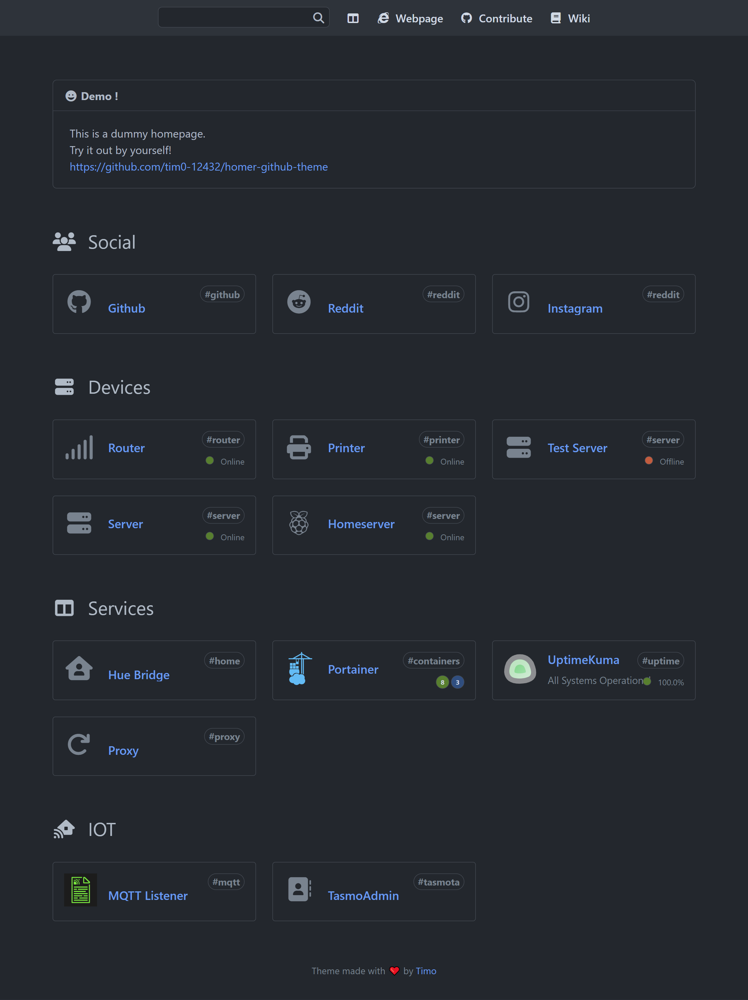

<h1 align="center">
    <br/>
    Github Theme for Homer
</h1>

<h4 align="center">
  Github Theme is a Github inspired theme for the <a href="https://github.com/bastienwirtz/homer">Homer Dashboard.</a>
</h4>


<h6 align="center">
  <bold>Disclaimer:</bold> This theme is not in any way affiliated with the official Github brand.
</h6>

## Installation

For a basic installation of Homer, please refer to the [Homer documentation](https://github.com/bastienwirtz/homer#getting-started).

1. Visit the github [releases page](https://github.com/tim0-12432/homer-github-theme/releases) and download the files you want from the **latest** release.
  - `config.yml` contains a example config file for homer.
  - `gh-base.min.css` contains the basic styling for the theme. **So this is required!**
  - `gh-dark.min.css` contains colors similar to the Github Dark theme.
  - `gh-dimmed.min.css` contains colors similar to the Github Dimmed theme.
  - `gh-light.min.css` contains colors similar to the Github Light theme.
2. Copy the files to your homer `assets` directory.
3. Reference the files in your `config.yml` file:
```yaml
stylesheet:
  - "assets/gh-dimmed.min.css"
  - "assets/gh-base.min.css"
```
4. Reload the page in your browser.

## Comparison of the themes

<p align="center">
  <a title="Dark theme" href="./docs/screenshot_dark.png">
    
  </a>
  &nbsp;&nbsp;
  <a title="Dimmed theme" href="./docs/screenshot_dimmed.png">
    
  </a>
  &nbsp;&nbsp;
  <a title="Light theme" href="./docs/screenshot_light.png">
    
  </a>
</p>

## Annotations

- This is a theme for the awesome [Homer Dashboard](https://github.com/bastienwirtz/homer).
- The config template is based on the also very decent [Homer-Theme](https://github.com/walkxcode/homer-theme). Please have a look at it, if you want to try other themes, as well.

## Contributing

If you have any ideas, just open an issue and tell me what you think about this theme.
Pull requests are welcome, too.

## License

This project ist licensed under [MIT](./LICENSE.md) license.
